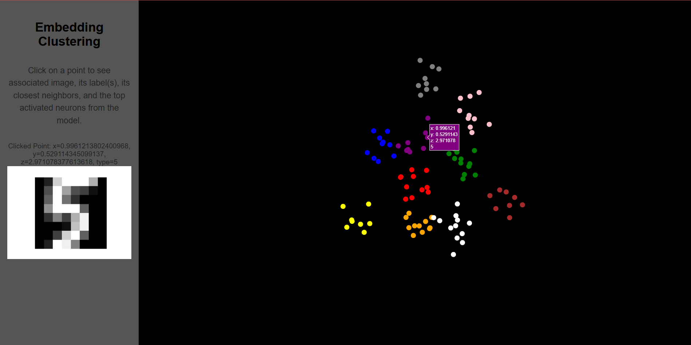

# 3D Embedding Visualizer



This project is a 3D embedding visualizer that leverages Flask for the backend and Plotly.js for interactive visualization. The application allows users to explore high-dimensional data visualized in 3D, with additional features like image previews and categorical clustering.

This release is just a proof of concept to show an interactive 3D scatter plot with points associated to clusters and images generated from 100 MNIST images and manually created clusters.

## Features

- **3D Scatter Plot**: Visualize data points in a 3D space with distinct clusters.
- **Interactive Hover**: Displays detailed information and corresponding images for data points in a sidebar when clicked/hovered.
- **Dynamic Clustering**: Simulate or use real datasets with labeled clusters for enhanced exploration.
- **Customizable Visualization**: Easily adaptable layout and color mapping for various datasets.

## Installation

1. Clone the repository:
   ```bash
   git clone https://github.com/Ryan-J-Gilbert/EmbeddingsVisualizer.git
   cd EmbeddingsVisualizer
   ```

2. Create and activate a virtual environment:
   ```bash
   python3 -m venv venv
   source venv/bin/activate  # On Windows, use `venv\Scripts\activate`
   ```

3. Install dependencies:
   ```bash
   pip install -r requirements.txt
   ```

4. Prepare the dataset:
   - Ensure your dataset (`toydataset.csv`) is in the project directory or update the path in `app.py`.

## Usage

1. Start the Flask server:
   ```bash
   python app.py
   ```
   or
   ```bash
   flask run
   ```

2. Open your browser and navigate to:
   ```
   http://127.0.0.1:5000/
   ```

3. Interact with the 3D scatter plot:
   - Hover and click over points to view the corresponding image and label in the sidebar.

## File Structure

```
.
├── app.py                 # Flask backend
├── templates/
│   └── index.html         # Frontend for visualization
├── static/
│   └── images/            # Contains 100 MNIST images
├── toydataset.csv         # Sample dataset (replaceable with your own)
├── requirements.txt       # Python dependencies
├── test.ipynb             # Notebook to fetch MNIST images and generate toy dataset
└── README.md              # Project documentation
```
